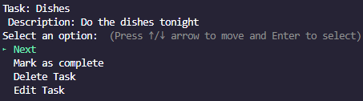

# **Task Tracker Terminal Application**

### *"An application designed to assist you with managing tasks and keeping you inspired."*
  
####  [Github Repo](https://github.com/JaiMathers/T1A3)

#### [Trello board](https://trello.com/b/m18SUsqe/t1a3)

## **Installation**

To execute, navigate to unpacked folder and run in terminal:

    ./run_index.sh

This will install bundled gems and launch the application.

## **Gems & Dependencies**

  - TTY-Prompt (~> 0.23.1)
  - TTY-ProgressBar (~> 0.18.2)
  - Colorize (~> 0.8.1)
  - JSON (~> 2.6)
  - bcrypt (~> 3.1)

## **Usage**

### **Command line inputs**

When first executed, the splash screen is displayed using `TTY-Prompt`, giving the the options of logging in, creating an account or exiting. You can navigate every menu by using the arrow keys and confirming your choice with the 'Enter' key.

When logging in, creating an account, or adding tasks, follow prompts and input details, confirming each with the 'Enter' key.

## **Testing** 

Using Ruby's `File` function in the `MasterData.load` method, the app checks if the corresponding `db.json` file, where user data is stored exists. If the file exists, it will load the `User` class parameters. If the file does not exist, it will create it in the directory with the application and enable read and write access to store newly input user data.

    ==> #if db.json doesn't exist, creates it for data storage
    newdb = File.new("./db.json", 'w+')  ==> #creates new file
    tmp = []  ==> #temporary array for user data
    newdb.syswrite(tmp.to_json) ==> #writes data to .json file

## **Error handling**

Within the `splash` method there is a rescue command for when the user's selected choice is to exit. This rescue fixes the menu looping on itself infinitely. 

    if selected_choice == "login"
	  	masterData.login
    elsif selected_choice == "register"
	  	masterData.create_user
    else selected_choice == "exit"
      begin
        exit
      rescue SystemExit
      end
      system "clear"
	  end

In the instance of a selected choice being incorrectly assigned, this block can be uncommented in the `main.dashboard.selected_choice` case to show the data type:

    else   ==> #printing data type the selected choice is () [] {}
      puts "WHAT ARE YOU????????? #{selected_choice}"
      dashboard(masterData)
    end

## **Features**

### **Feature 1: Verified users & Encrypted passwords**

The app offers personalised accounts to separate and secure data for users. When creating an account, a username and password is required to verify the user. These passwords are encrypted with the `bcrypt` gem, ensuring security over the account access. If no values are entered for either prompt, an error message will appear asking for an input. 

An example of data saved within the created `db.json` file with the encrypted password:

    {
      "json_class": "User",
      "username": "jimbo1",
      "password": "$2a$12$FoBplO9/M56HUmCvJihCTOgY6GlNQJKiNhTg4DwTGzPKkd.mFyzYS",
      "fname": "Jim",
      "tasks": "[]",
      "completed_tasks": "[]"
    }

### **Feature 2: Task viewing & management**

The app contains multiple ways of interacting with created tasks. This includes:

  - Creating new tasks
  - Modifying existing tasks
  - Deleting tasks
  - Viewing active and completed task lists
  - Marking tasks as "completed"

When creating a new task, a `name` and `description` are required to ensure the clarity of the task.

When modifying an existing task, the new `name` and `description` can be entered and verified by viewing the task list.

When deleting a task, you can delete the shown task, or navigate using the `Next` prompt to select the desired task.

### **Feature 3: Quotes function**

The `Quotes` option on the dashboard uses a `tty-prompt` to allow the user to select a number and return a colorized inspirational quote.

When the user is feeling motivated, they can press `Enter` to return to the dashboard.

